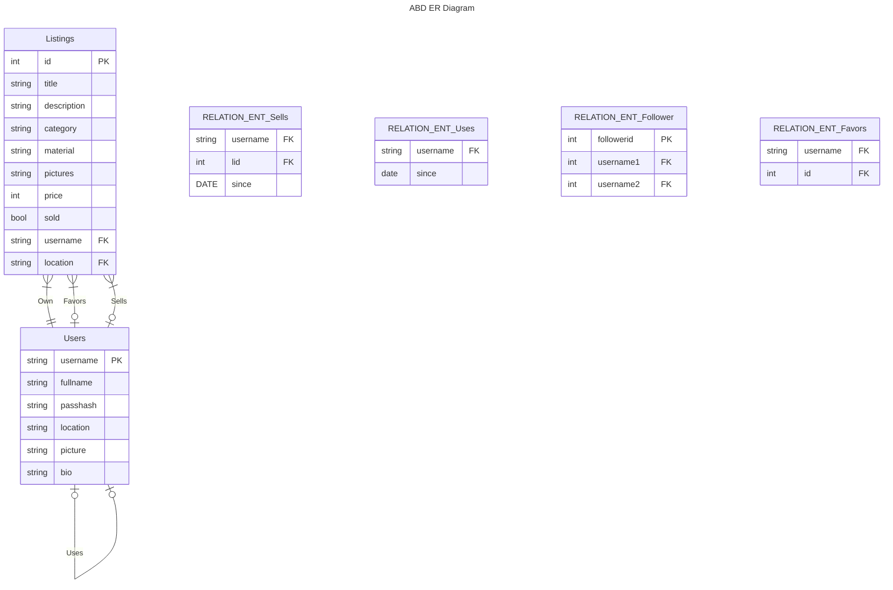

## ABD - a dba clone
Last Project from the DIS course at KU datalogi developed by Mahmood Seoud (tbc115@alumni.ku.dk) and Phillip Lundin (kxg220@alumni.ku.dk). The project is a clone from the popular second hand platform https://www.dba.dk called ABD.

## KU Tags
Phillip Lundin [kxg220]
Mahmood Mohammed Seoud [tbc115]

# Getting started
Install the necessary libraries in order to launch the server.
Starting the website 
```bash
cd client && npm i
npm start
```

Starting the server \
Start a new terminal
```bash
cd server && npm i
node index.js
```

## Remember to create a environment file
In order to define your user settings for effective setup. Create this file in the './server/' folder with the following command `touch ./server/.env`. Paste the text from below into the .env file that you just created.
```
DATABASE_NAME=<database name>
DATABASE_HOST=localhost
DATABASE_PASSWORD=<database password>
DATABASE_PORT=<database port>(most likely 5432)
DATABASE_USER=<database username>

COOKIE_SECRET=keyboard cat
ENVIRONMENT=production
```
where `<database username>` is your currently logged in username e.g 'phillip' as in '/Users/phillip/' or on windows 'C:/Users/phillip'

### PostgresSQL
Be sure to have PostgreSQL installed from [Standalone PostgreSQL](https://www.postgresql.org/download/) or by downloading the latest PostgresSQL from brew `brew install postgresql`. \
Be sure to run SQL file in the server to create the instances of the tables so it can talk with the server and client. You can do that with the command:

```
psql -d <database name> < ./server/database.sql && psql -d <database name>
```

You can also configure it manually from the [server file](https://github.com/Nidocq/ABD_DIS-Projekt/blob/main/server/database.sql) (Remember `<database name>` should be the same name as the DATABASE_NAME in the .env file). Please configure the .env file to match the rest of the credentials.

#### Software used
:page_facing_up: [React (Front end)]() \
:page_facing_up: [NodeJS (Server)]()

#### How to use the platform
Since this is a clone of DBA. You are of course able to list your items for sale 
> Note: We have provided some dummy users, and listings to make improve the experience.
- *Sign up* Sign up with a user to the platform that includes, username, password, fullname etc. Note that username will be your unique identifer.
- *Login* Login with your created account or the dummy accounts provided.
- *Create listing* Create a listing where you enter all the listing data.
- *View other listings* See other users listings
- *Update listing* You can update your listing. Note that you are only able to update the listings that *YOU* have created.


#### Known issues and shortcomings
- When refreshing the browser, the user is logged out
- The category buttons are not actually quering any items 
- Styling issues.
- The picture in create listing will not appear until you have created the actual listing
- If you reevaluate the picture-url when editing a listing, the server will crash
- Integers can be overflow for price and there is no error handling for that
- The `user_since` table has not been implenented

#### Improvements for next time 
In the development of our web app, we want to inform you that not all data tables have been fully implemented. This decision was made to prioritize the quality and functionality of the web app within the available resources and time constraints.

# DISCLAIMER!
- Don't post any real names, password, or other sensitive data as this website is vulnearable. \
This of course only applies if this project is launched on a server.
# E/R Diagram
