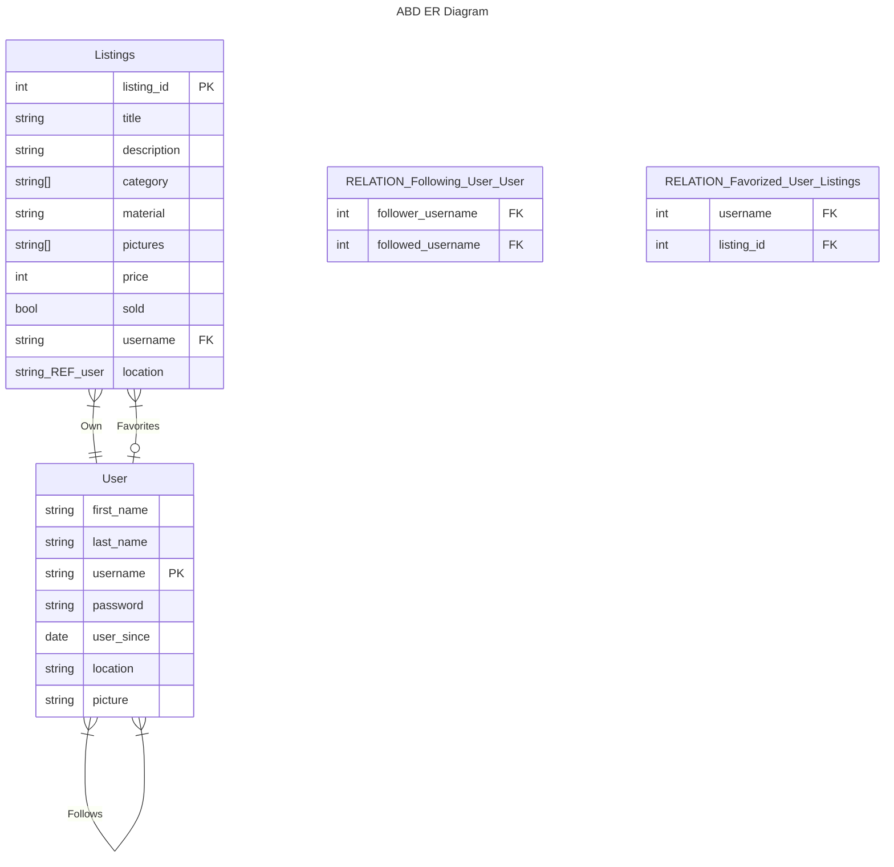

## ABD
Last Project from the DIS course at KU datalogi developed by Mahmood Seoud (email) and Phillip Lundin (kxg220@alumni.ku.dk). The project is a clone from the popular second hand platform https://www.dba.dk called ABD.


# Getting started
Install the necessary libraries in order to launch the server.
Starting the website 
```bash
cd client && npm i
npm start
```

Starting the server \
Start a new terminal
```bash
cd server && npm i
node index.js
```

Remember to create a environment file in order to define your user settings
for effective setup. Create this file in the './server/' folder. \
An example file looks like this:
```
DATABASE_NAME=my_database
DATABASE_HOST=localhost
DATABASE_PASSWORD=
DATABASE_PORT=5432
DATABASE_USER=<username>

COOKIE_SECRET=keyboard cat
ENVIRONMENT=production
```
where <username> is the logged in user e.g : '/Users/phillip/' or on windows 'C:/Users/phillip'

### PostgresSQL
Be sure to have PostgreSQL installed from [Standalone PostgreSQL](https://www.postgresql.org/download/) or by downloading the latest PostgresSQL from brew `brew install postgresql`.
<<<<<<< HEAD
Be sure to run SQL file in the server to create the instances of the tables so it can talk with the server and client. You can do that with the `psql < ./server/database.sql`. Remember to configure the .env file to match the credentials. We have called our database 'my_database'
=======
Be sure to run SQL file in the server to create the instances of the tables so it can talk with the server and client.
>>>>>>> e02e24d71066cb83a5752f4b42a761aeac003c72

#### Software used
:page_facing_up: [React (Front end)]() \
:page_facing_up: [NodeJS (Server)]()

### E/R Diagram

